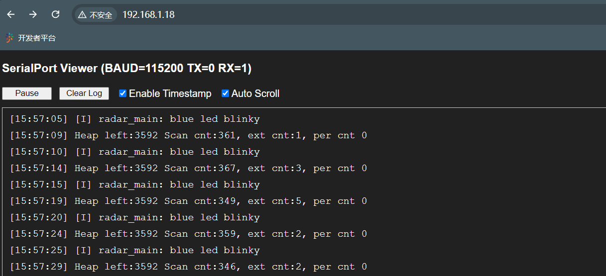
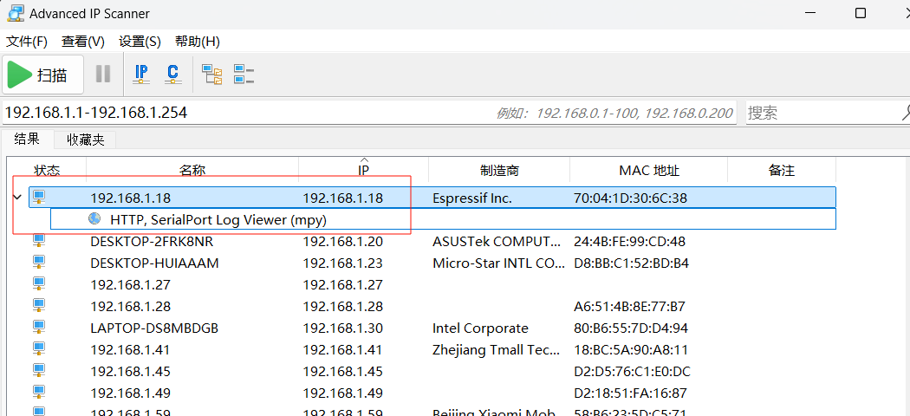
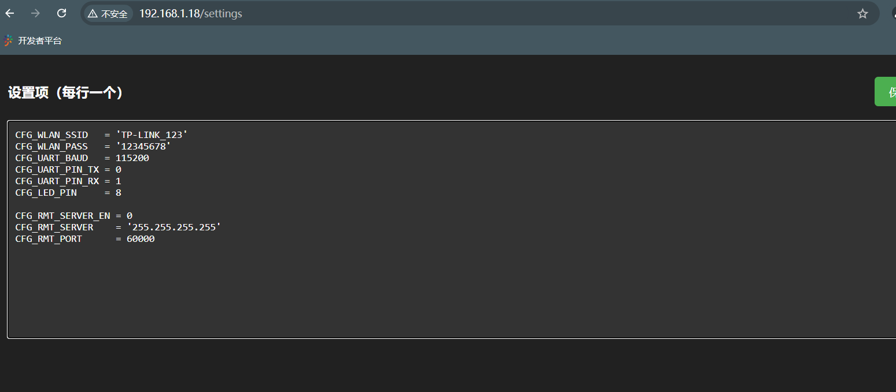

## 无线串口日志打印工具

在开发调试电子产品的过程中，有时候不方便将串口接到电脑看日志，有时候需要长时间抓取日志，也不方便一直连着电脑

这时候可以使用无线串口工具，借助WIFI，来远程打印日志，并进行持久记录



### 所需硬件

一个 ESP32-C3 开发板模块，请自行购买，比如：

https://github.com/WeActStudio/WeActStudio.ESP32C3CoreBoard

https://www.nologo.tech/product/esp32/esp32c3SuperMini/esp32C3SuperMini.html#%E7%AE%80%E4%BB%8B

### 固件烧录

> 需自行安装 python 包 esptool
> 以及 Python Thonny 软件

首先 Clone 本仓库到你的桌面

- 全片擦除
  ```shell
  esptool --chip esp32c3 --port <串口名字> erase_flash
  ```

- 烧录micropython固件
  ```shell
  esptool --chip esp32c3 --port <串口名字> --baud 921600 write_flash -z 0x0 ./firmware/firmware-v1.23.0.bin
  ```

- 用 Python Thonny 打开 client 目录：

  由于模块需要连接到局域网络，因此我们要给它配置一个**现有的WIFI，让它去连接**

  注意：WIFI必须是2.4G的，不支持5G WIFI

  打开 `app.py` 文件，找到如下配置项，填写 WIFI 名字，密码，保存
  ```
  CFG_WLAN_SSID   = '<SSID>'
  CFG_WLAN_PASS   = '<PASS>'
  ```

  然后将该目录下的所有文件上传到你的 esp32 板子

### 使用

esp32板子的默认串口配置：波特率 115200，TX 为 0 号脚，RX 为 1 号脚

把上述的 esp32 板子的 TX, RX, VCC, GND 连接到你需要记录日志的设备上，然后给你的设备通电。

esp32板子的指示灯会亮起，待指示灯熄灭后，代表网络已连接

由于没有屏幕设备，因此需要使用 局域网扫描工具 获取 esp32 的 IP 地址



扫描到地址后，在浏览器中直接访问该 ip 即可进入日志查看 WEB 页面

### 在线配置

访问 /settings 路径，可以在线修改配置，重启后生效



可用的配置

|键|类型|描述|
|:---|:---|:---|
|CFG_DEVICE_TAG|string|设备标签，当有多个设备时，可通过修改标签区分不同设备|
|CFG_WLAN_SSID|string|WIFI名称|
|CFG_WLAN_PASS|string|WIFI密码|
|CFG_UART_BAUD|int|串口波特率|
|CFG_UART_PIN_TX|int|串口TX脚号|
|CFG_UART_PIN_RX|int|串口RX脚号|
|CFG_LED_PIN|int|LED指示灯脚号|
|CFG_RMT_SERVER_EN|int|是否启用远程日志持久记录（默认关闭）|
|CFG_RMT_SERVER|string|远程记录服务ip地址|
|CFG_RMT_PORT|int|服务器端口，默认60000|

### 日志持久记录

默认的 web 页面只能临时查看日志，如果要同时持续记录日志到文件，需要运行日志记录器

方法如下：

在电脑上安装 NodeJS

cd 到 server 目录下，运行 `node ./rmt_recorder.js` 即可运行日志记录服务，默认端口号 60000

访问 http://你的esp32的ip/settings 路径，打开上一步中 WEB 配置页面，进行如下修改：

```
CFG_RMT_SERVER_EN=1
CFG_RMT_SERVER='填上一步运行node命令的电脑的ip'
```

将设备断电再通电，等待 esp32 设备连接到网络后，会自动连接到服务程序

此时应该能看到日志记录服务的日志 `new connection: xxxxx`

而设备的日志将被记录到 ./log_xxx.xxx.xxx.xxx.log
